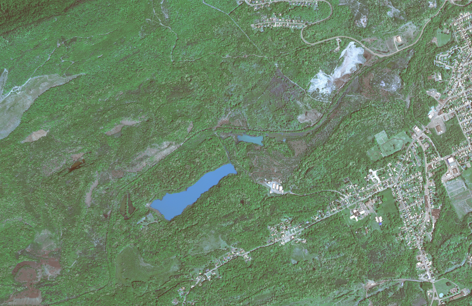
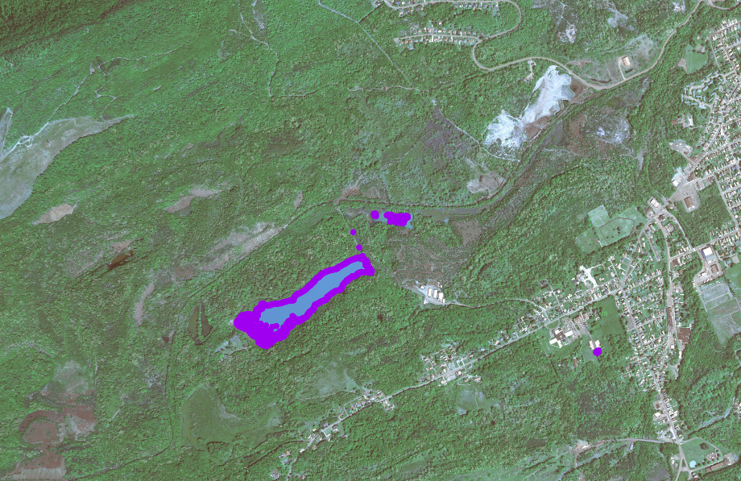

# DischargeScript
## Purpose
Pennsylvania has a rich history of Anthracite coal mining. Unfortunately, a by product of this mining is acid mine drainage (AMD). AMD is a significant and widespread source of pollution, and remediation relies on the cataloguing of these AMD discharge points. Due to the widespread nature of mining in Pennsylvania, these discharges can go unnoticed and unremediated. This script serves as a proof-of-concept that certain characteristics of AMD discharges can be detected from remotely sensed imagery, and subsequently geolocated and catalogued for potential future remediation. 

## Requirements
* Python 3.7+
* * OpenCV
* * imutils
* * Numpy 
* GDAL 2.0+ (built with Python support)

## Testing
### Requirements
* A GeoTiff image
* The requirements listed above

### Running
* Navigate to the ```cli/scripts``` folder
* Run ```convert.sh``` like so: ```./convert.sh input_geotiff.tif output_png.png```
* Run the Python script like so: ```python3 amd.py -i output_png.png```
* Run the pixel -> UTM converter like so: ```./make_coordinates.sh input_geotiff.tif pixel_coordinates.txt utm_coordinates.txt```

### Sample output
Original input image


Contoured output

