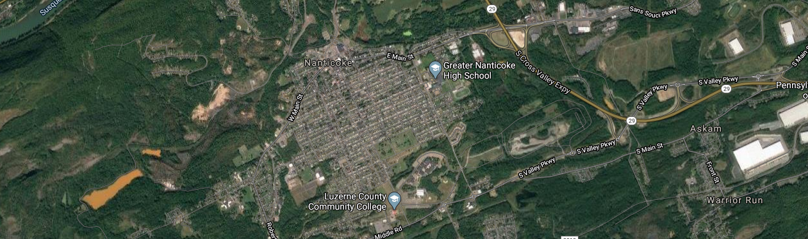
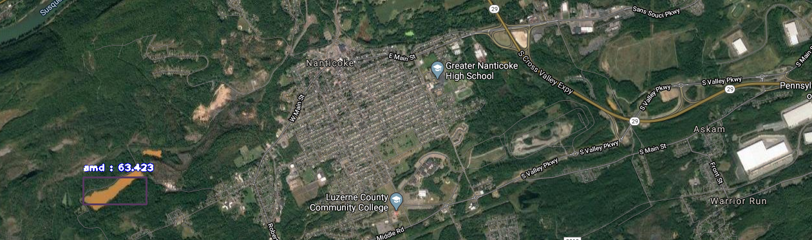

# DischargeScript
## Purpose
Pennsylvania has a rich history of Anthracite coal mining. Unfortunately, a by product of this mining is acid mine drainage (AMD). AMD is a significant and widespread source of pollution, and remediation relies on the cataloguing of these AMD discharge points. Due to the widespread nature of mining in Pennsylvania, these discharges can go unnoticed and unremediated. This script serves as a proof-of-concept that certain characteristics of AMD discharges can be detected from remotely sensed imagery, and subsequently geolocated and catalogued for potential future remediation. 

## Requirements
* See ```requirements.txt```
* A half decent GPU (or a free CoLab instance to train a new model)

## Sample Output
* A sample of this project can be found here [link](https://learn.codyben.me)
* Additionally, sample photos can be seen below.

Sample Input


Sample Output


## Models
* Coming soon. Gotta find a good place that they can be stored for a while (i.e not my Google Drive)


